# Fagent → Agentic Architecture Plan

## Current State Analysis

### What exists today
The current pipeline is a **single-shot planner**:

```
User Instruction
     ↓
context::scan_workspace()      ← flat snapshot, depth-limited, 256 entries max
     ↓
llm::plan() → ExecutionPlan    ← one LLM call, returns full JSON action list
     ↓
plan::validate_plan()          ← static pre-flight checks
     ↓
ui::review_plan()              ← human approval gate
     ↓
executor::run_with_recovery()  ← sequential action runner with rollback
     ↓
Done (or retry with edited instruction)
```

### Core limitations for scalable / complex tasks
| Pain point | Root cause |
|---|---|
| Full workspace must fit in one prompt | `scan_workspace` is flat & byte-capped at 24 KB |
| No sub-goal decomposition | LLM must plan *everything* in one shot |
| No observation after each action | Executor result never feeds back into LLM |
| No tool selection | Only filesystem actions exist; no read-file, search, etc. |
| No memory across turns | Instruction is the only persistent state |
| Stale context | Workspace is scanned once before planning, not after each step |

---

## Target Architecture: Agentic Loop

Inspired by ReAct / OpenAI function-calling / IDE agent patterns:

```
┌──────────────────────────────────────────────────────────┐
│                       Agent Session                       │
│                                                          │
│  User Goal  ──►  Planner LLM ◄── Memory / History        │
│                      │                                    │
│              ┌───────▼───────┐                           │
│              │  Tool Call(s) │  (one or more per turn)   │
│              └───────┬───────┘                           │
│                      │                                    │
│              ┌───────▼───────┐                           │
│              │  Tool Runner  │  (executes, captures obs) │
│              └───────┬───────┘                           │
│                      │                                    │
│              Observation ──► back to Planner LLM          │
│                      │                                    │
│              Repeat until  ──► "task_complete" signal     │
└──────────────────────────────────────────────────────────┘
```

---

## Module-by-Module Refactor Plan

### Phase 1 — Tool System (`src/tools/`)  ✦ Foundation

Create a **typed tool registry** so the LLM can call individual tools rather than returning one monolithic JSON plan.

**New files:**
- `src/tools/mod.rs` — `Tool` trait + `ToolRegistry`
- `src/tools/fs_tools.rs` — wrap existing executor actions as individual tools
- `src/tools/read_file.rs` — read file content (new capability)
- `src/tools/search.rs` — glob/regex search within workspace (new capability)
- `src/tools/task_complete.rs` — terminal signal tool

**Tool trait:**
```rust
#[async_trait]
pub trait Tool: Send + Sync {
    fn name(&self) -> &'static str;
    fn description(&self) -> &'static str;
    fn parameters_schema(&self) -> serde_json::Value;  // JSON Schema
    async fn call(&self, params: serde_json::Value, policy: &WorkspacePolicy)
        -> ToolResult;
}

pub struct ToolResult {
    pub output: String,        // what the LLM sees as the observation
    pub is_error: bool,
    pub side_effects: Vec<CompletedAction>,  // for rollback
}
```

**Initial tool set:**
| Tool name | Replaces / new |
|---|---|
| `list_directory` | wraps `context::scan_workspace` but scoped & on-demand |
| `read_file` | **new** — reads file contents up to a token budget |
| `search_paths` | **new** — glob match in workspace |
| `create_dir` | extracted from executor |
| `create_file` | extracted from executor |
| `move_file` | extracted from executor |
| `rename_path` | extracted from executor |
| `zip_path` | extracted from executor |
| `unzip_archive` | extracted from executor |
| `delete_path` | extracted from executor |
| `task_complete` | **new** — signals the agent loop to stop |

> [!IMPORTANT]
> Keep the existing `executor.rs` rollback machinery intact. `Tool::call` should
> push `CompletedAction` records to a shared rollback journal so full session
> rollback remains possible.

---

### Phase 2 — Agent Memory (`src/memory.rs`)  ✦ State

```rust
pub struct AgentMemory {
    pub goal: String,
    pub turns: Vec<Turn>,        // full history for the LLM context window
    pub journal: RollbackJournal, // completed actions for undo
    pub token_budget: usize,     // trim old turns when approaching limit
}

pub struct Turn {
    pub role: TurnRole,          // System | Assistant | ToolResult
    pub content: TurnContent,
}

pub enum TurnContent {
    Text(String),
    ToolCall { name: String, params: serde_json::Value },
    ToolResult { name: String, result: ToolResult },
}
```

**Windowing strategy:** Keep the system prompt + goal + last N turns within the
model's context window. Summarise older turns via a cheap "summarise history" LLM
call when the budget is exceeded.

---

### Phase 3 — Agentic Loop (`src/agent.rs`)  ✦ Core

Replace `run_instruction_loop` in `main.rs` with a proper agent loop:

```rust
pub struct Agent {
    provider: Box<dyn LlmProvider>,
    tools: ToolRegistry,
    memory: AgentMemory,
    policy: WorkspacePolicy,
    config: AgentConfig,
}

impl Agent {
    pub async fn run(&mut self, ui: &dyn AgentUi) -> Result<AgentOutcome> {
        loop {
            // 1. Build prompt from memory
            let request = self.memory.build_request(&self.tools);

            // 2. Call LLM → get tool call(s) or final message
            let response = self.provider.call(&request).await?;

            // 3. Parse response
            match response {
                LlmResponse::ToolCalls(calls) => {
                    for call in calls {
                        // 4a. Human approval gate (configurable: auto / per-tool / per-session)
                        if ui.should_approve(&call)? {
                            // 4b. Execute tool
                            let result = self.tools.call(&call, &self.policy).await;
                            // 4c. Record in memory + journal
                            self.memory.push_tool_result(&call, result);
                        }
                    }
                }
                LlmResponse::TaskComplete { summary } => {
                    ui.print_summary(&summary);
                    return Ok(AgentOutcome::Done);
                }
                LlmResponse::Message(text) => {
                    ui.print_message(&text);
                    // ask user for clarification or next instruction
                    let reply = ui.prompt_user()?;
                    self.memory.push_user_message(reply);
                }
            }
        }
    }
}
```

**`AgentConfig`** exposes:
- `max_turns: usize` — hard cap to prevent infinite loops
- `approval_mode: ApprovalMode` — `Auto | PerTool | PerSession | PerRiskyTool`
- `max_tool_retries: usize`

---

### Phase 4 — LLM Provider Upgrade (`src/llm/`)  ✦ Protocol

Switch from "return a JSON plan" to **native function/tool calling** APIs:

```rust
#[async_trait]
pub trait LlmProvider: Send + Sync {
    // NEW: replaces plan()
    async fn call(&self, request: &AgentRequest) -> Result<LlmResponse>;
}

pub struct AgentRequest {
    pub messages: Vec<Message>,   // full conversation history
    pub tools: Vec<ToolSpec>,     // JSON Schema definitions of available tools
    pub model: String,
}

pub enum LlmResponse {
    ToolCalls(Vec<ToolCallRequest>),
    TaskComplete { summary: String },
    Message(String),
}
```

All four providers (OpenAI, Anthropic, Gemini, Ollama) already support function
calling — map to their respective APIs:

| Provider | API field |
|---|---|
| OpenAI | `tools` + `tool_choice` |
| Anthropic | `tools` + `tool_use` content blocks |
| Gemini | `tools[].functionDeclarations` |
| Ollama | `tools` (OpenAI-compatible) |

> [!NOTE]
> Keep the old `plan()` path behind a feature flag or fallback for providers
> that don't support tool calling, so nothing breaks during migration.

---

### Phase 5 — UI Layer (`src/ui.rs` extension)  ✦ Experience

Add `AgentUi` trait so the approval/feedback loop can be composed without
coupling the agent core to terminal I/O:

```rust
pub trait AgentUi: Send + Sync {
    fn should_approve(&self, call: &ToolCallRequest) -> Result<bool>;
    fn print_tool_result(&self, name: &str, result: &ToolResult);
    fn print_summary(&self, text: &str);
    fn prompt_user(&self) -> Result<String>;
    fn print_turn_header(&self, turn_index: usize);
}
```

**Interactive terminal implementation** (`InteractiveAgentUi`):
- Show each tool call with its parameters before execution (like a diff view)
- `[y]es / [n]o / [a]ll / [q]uit` approval per tool call
- Spinner/progress indicator between turns
- Collapsible turn history display

---

### Phase 6 — Context Intelligence (`src/context.rs` upgrade)  ✦ Scalability

Replace the one-shot 256-entry flat scan with **lazy, on-demand context tools**:

- `list_directory(path, depth)` — scoped scan, no global cap
- `read_file(path, max_bytes)` — file content with byte budget
- `search_paths(glob_pattern)` — find files by pattern without listing all
- Agent only requests what it needs, avoiding the 24 KB cap problem entirely

Also add **`ContextCache`**: cache directory listings with TTL = until the agent
executes a write action in that directory. Avoids redundant scans within one
session.

---

## File/Module Map (After Refactor)

```
src/
├── agent.rs            ← NEW: Agent struct + run loop
├── cli.rs              ← extend: add --max-turns, --approval-mode flags
├── config.rs           ← minor: add AgentConfig fields
├── context.rs          ← upgrade: ContextCache + targeted scan helpers
├── error.rs            ← add AgentError variants
├── executor.rs         ← keep: rollback journal, action types
├── lib.rs              ← re-export new public API
├── llm/
│   ├── mod.rs          ← upgrade: AgentRequest/LlmResponse, keep plan() compat
│   ├── anthropic.rs    ← upgrade: tool_use support
│   ├── gemini.rs       ← upgrade: functionDeclarations support
│   ├── ollama.rs       ← upgrade: OpenAI-compat tools
│   └── openai.rs       ← upgrade: tools + tool_choice
├── main.rs             ← switch to Agent::run()
├── memory.rs           ← NEW: AgentMemory + Turn history + RollbackJournal
├── plan.rs             ← keep: ValidatedPlan (used by rollback)
├── security.rs         ← unchanged
├── tools/
│   ├── mod.rs          ← NEW: Tool trait + ToolRegistry
│   ├── fs_tools.rs     ← NEW: filesystem action tools (wraps executor)
│   ├── read_file.rs    ← NEW: read file content
│   ├── search.rs       ← NEW: glob/regex search
│   └── task_complete.rs← NEW: terminal signal
└── ui.rs               ← extend: AgentUi trait + InteractiveAgentUi
```

---

## Implementation Phases & Order

```mermaid
gantt
    title Fagent Agentic Refactor
    dateFormat  X
    axisFormat  Phase %s

    section Foundation
    Tool trait + ToolRegistry         :p1a, 0, 1
    Wrap executor actions as tools    :p1b, after p1a, 1
    read_file + search_paths tools    :p1c, after p1b, 1

    section State
    AgentMemory + Turn history        :p2, after p1c, 1
    RollbackJournal integration       :p2b, after p2, 1

    section Core Loop
    Agent struct + run()              :p3, after p2b, 2
    AgentUi trait + Interactive impl  :p3b, after p3, 1

    section LLM Upgrade
    LlmProvider tool-calling API      :p4, after p3, 2
    Anthropic tool_use                :p4a, after p4, 1
    Gemini functionDeclarations       :p4b, after p4a, 1
    Ollama + OpenAI tools             :p4c, after p4b, 1

    section Polish
    Context cache + lazy scanning     :p5, after p4c, 1
    Max-turns guard + approval modes  :p5b, after p5, 1
    CLI flags + docs                  :p5c, after p5b, 1
```



### Recommended start: Phase 1 (Tool system)
It is the only phase with **zero breaking changes** — existing plan-based flow
stays intact while you build the new foundation alongside it.

---

## Key Design Decisions

| Decision | Recommendation | Rationale |
|---|---|---|
| Tool calling strategy | Native function-calling APIs | More reliable than prompt-injected JSON; all 4 providers support it |
| Approval granularity | `--approval-mode` flag (default: per risky tool) | Balances safety with automation |
| Context strategy | Lazy on-demand via tools | Removes 24 KB cap; scales to huge repos |
| Memory windowing | Token-budget sliding window + summarise | Prevents context overflow on long tasks |
| Rollback scope | Full session journal (not per-plan) | Agent may run many micro-plans; rollback should span all |
| Backward compat | Keep `plan()` as fallback | Lets Ollama/local models without tool-calling still work |
| Loop termination | `task_complete` tool + `max_turns` hard cap | Prevents runaway loops |

---

## Backward Compatibility

> [!WARNING]
> The existing single-shot `fagent "instruction"` CLI invocation **must keep working**
> throughout the refactor. Use a `--agent` flag to opt into the new loop, and
> default to the old pipeline until Phase 3 is stable.

```
fagent "move all logs"              ← old pipeline (unchanged)
fagent --agent "reorganise project" ← new agent loop
```

Once the agent mode is stable and battle-tested, promote it to default and
deprecate the old flag.
